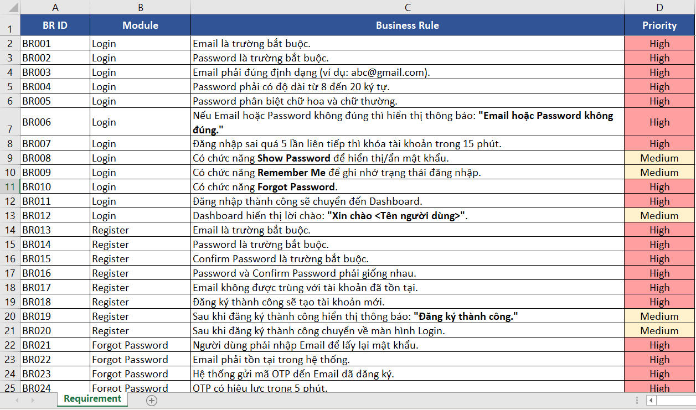
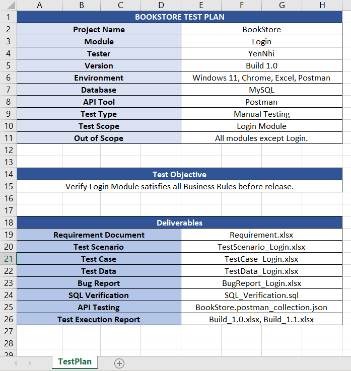
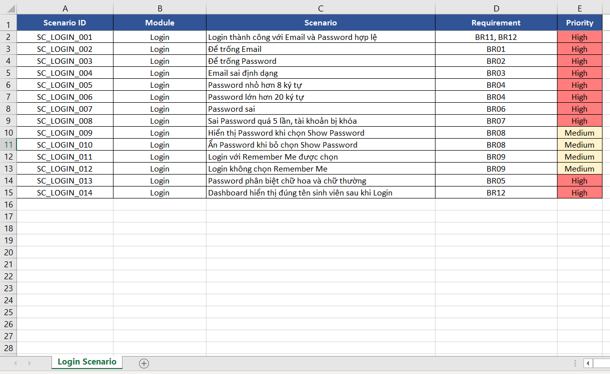
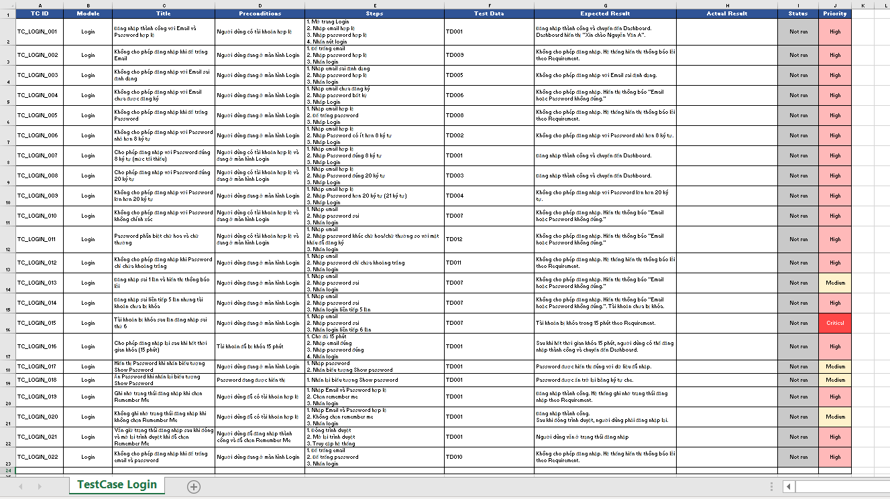
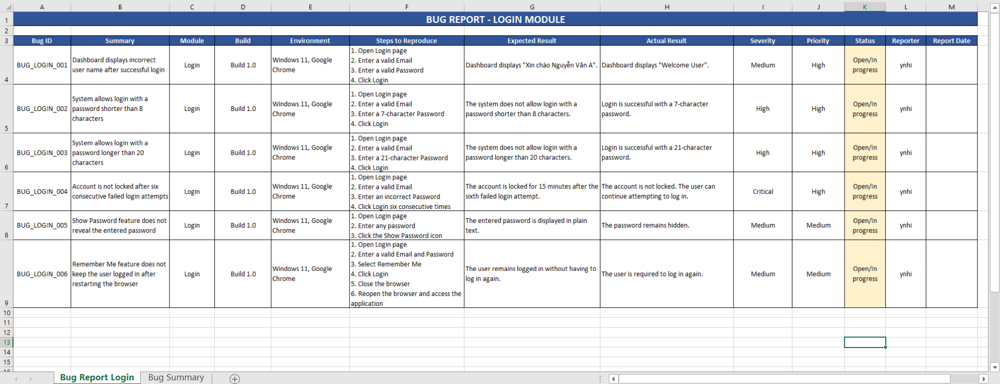
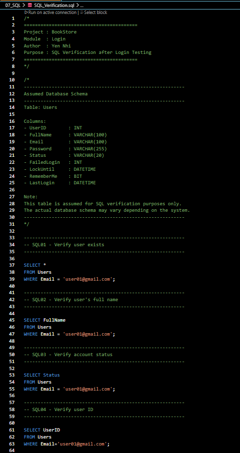
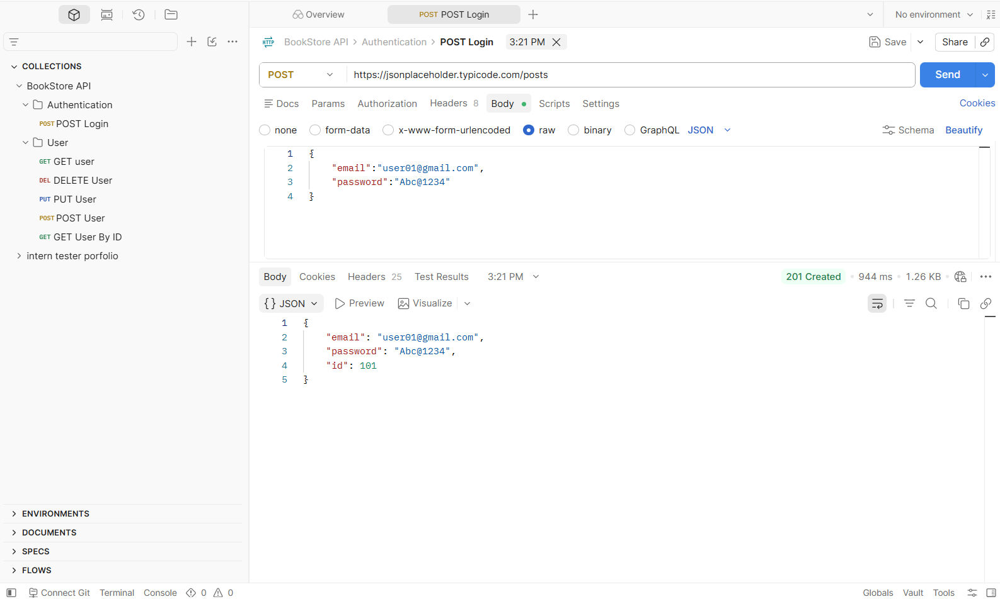
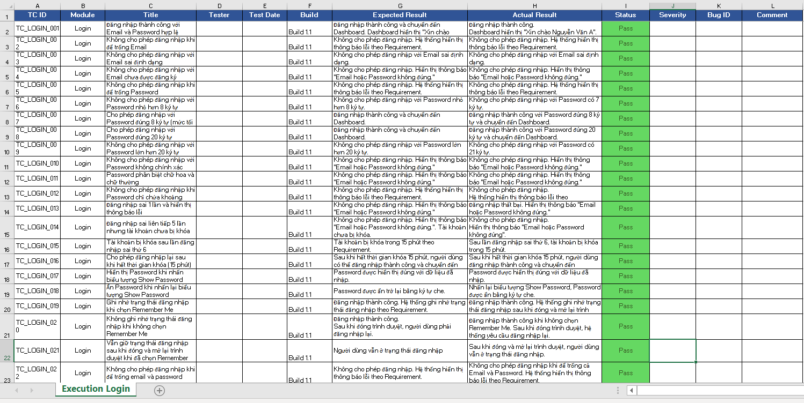

# BookStore Manual Tester Portfolio
> Manual Testing Portfolio built following the Software Testing Life Cycle (STLC).
---
# Project Overview
This repository contains a complete **Manual Testing Portfolio** for the **BookStore Login Module**.

The project demonstrates a standard Software Testing Life Cycle (STLC), including:
- Requirement Analysis
- Test Planning
- Test Scenario Design
- Test Case Design
- Test Data Preparation
- Test Execution
- Bug Reporting
- SQL Verification
- API Testing with Postman
- Retesting & Regression Testing

This portfolio was created for learning purposes and to demonstrate Manual Testing skills for **Intern QA positions**.
---
# Project Objectives
- Analyze software requirements
- Create Test Plan
- Design Test Scenarios
- Design Test Cases
- Prepare Test Data
- Execute test cases
- Report software defects
- Verify database using SQL
- Test REST APIs using Postman
- Perform Retesting & Regression Testing
- Manage project using Git & GitHub
---

# Project Structure
```
Manual-Tester-Portfolio
│
├── README.md
│
├── 01_Requirement
│   └── Requirement.xlsx
│
├── 02_Test_Plan
│   └── TestPlan.xlsx
│
├── 03_Test_Scenario
│   └── TestScenario_Login.xlsx
│
├── 04_Test_Case
│   └── TestCase_Login.xlsx
│
├── 05_Test_Data
│   └── TestData_Login.xlsx
│
├── 06_Bug_Report
│   └── BugReport_Login.xlsx
│
├── 07_SQL
│   └── SQL_Verification.sql
│
├── 08_API_Testing
│   └── BookStore API.postman_collection.json
│
├── 09_Test_Execution
│   ├── Build_1.0.xlsx
│   └── Build_1.1.xlsx
│
├── 10_ScreenShots
│
└── 11_Documents
```
---

# Testing Scope
Current testing scope:

### Login Module
Covered features:
- Login with valid account
- Empty Email validation
- Empty Password validation
- Invalid Email format
- Unregistered Email
- Password length validation
- Password boundary values (8–20 characters)
- Incorrect Password
- Password case sensitivity
- Account Lock after multiple failed attempts
- Show Password
- Remember Me
- Dashboard verification after successful login
---

# Test Artifacts
- Requirement
- TestPlan
- Test Scenario
- Test Case
- Test Data
- Test Execution
- Bug Report
- SQL Verification
- API Testing
- Retesting
- Regression Testing
---

# Test Execution Summary
| Build | Total | Pass | Fail | Block |
|------|------:|-----:|-----:|------:|
| Build 1.0 | 22 | 15 | 5 | 2 |
| Build 1.1 | 22 | 22 | 0 | 0 |
---

# Bug Summary
A total of **6 defects** were identified during Build 1.0.
| Bug ID | Summary | Severity |
|---------|---------|----------|
| BUG_LOGIN_001 | Dashboard displays incorrect user name | Medium |
| BUG_LOGIN_002 | System accepts password shorter than 8 characters | High |
| BUG_LOGIN_003 | System accepts password longer than 20 characters | High |
| BUG_LOGIN_004 | Account is not locked after six failed login attempts | Critical |
| BUG_LOGIN_005 | Show Password feature does not function correctly | Medium |
| BUG_LOGIN_006 | Remember Me feature does not retain login session | Medium |

All defects were fixed and successfully verified in **Build 1.1**.

---

# SQL Verification
SQL scripts were created to verify database records after login testing.

Verification includes:
- User information
- Account status
- Failed login attempts
- Account lock time
- Remember Me status
- Last Login information
---

# API Testing

API testing was performed using **Postman**.
Requests included:
- POST Login
- GET Users
- GET User by ID
- POST User
- PUT User
- DELETE User
---

# Tools & Technologies

- Microsoft Excel
- Visual Studio Code
- Postman
- SQL
- Git
- GitHub
---

# Screenshots

## Requirement

---

## Test Plan

---

## Test Scenario

---

## Test Case

---

## Bug Report

---

## SQL Verification

---

## API Testing (Postman)

---

## Test Execution - Build 1.1

---

# Author

**Yen Nhi**

Manual Tester Portfolio

GitHub:
https://github.com/ynhiuit

---

# Notes
This project was created for educational purposes and to demonstrate Manual Testing skills following the Software Testing Life Cycle (STLC). The Login module was tested from requirement analysis to final verification after defect fixes.